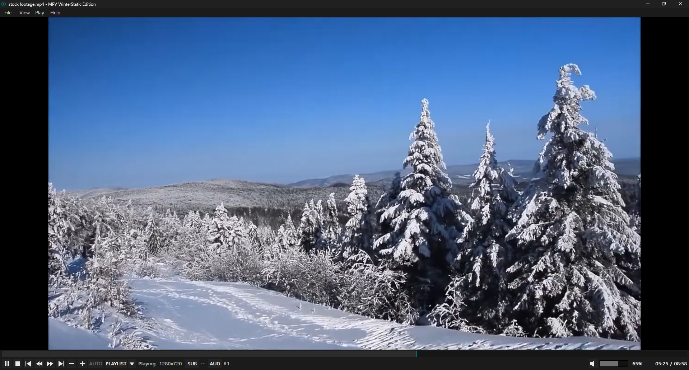

[README.md](https://github.com/user-attachments/files/31760161/README.md)
MPV WinterStatic Edition
Version 0.4.6
===================

MPV WinterStatic Edition is a lightweight native Win32 frontend for libmpv.
Its interface is intentionally MPC-style, but the frontend is independently
developed and does not contain MPC-QT source code.

Project: https://github.com/WinterStatic/MPV-WinterStatic-Edition

The player is designed to stay small, portable, and usable on older Windows PCs
without requiring Qt.

WHAT IS IN THIS BUILD KIT
-------------------------

- main.cpp
  Native Win32 frontend source.

- resource.rc
  Windows resources, dialogs, icons, and version metadata.

- app.manifest
  Windows application identity, DPI-awareness, and compatibility declarations.

- build-native.bat
  Builds the frontend with MSVC and creates a self-contained portable folder.

- collect-runtime.sh
  Collects libmpv and the runtime DLLs required by the portable build, records
  exact binary-package provenance, source-package bases, and installed licenses.

- collect-runtime-source.sh
  Release-only helper that downloads the exact official MSYS2 Source-Only
  Tarballs corresponding to the runtime packages actually shipped.

- LICENSE
  GNU GPL version 3 license text for the frontend (GPL-3.0-or-later).

- .gitignore
  Keeps MSVC outputs and generated portable folders out of Git commits.

- PUBLIC-RELEASE-CHECKLIST.md
  Distribution checklist for publishing source/full portable GitHub releases.

- THIRD-PARTY-NOTICE.txt
  Third-party software and licensing notice. In the finished portable build it
  is stored with the engine under libmpv\.

- mpv.conf
  MPV WinterStatic Edition's explicit, user-owned libmpv configuration file. It is
  kept beside the EXE and can be opened from
  View -> mpv configuration -> Open mpv.conf.

BUILD REQUIREMENTS
------------------

- Visual Studio 2022 Build Tools with the MSVC C++ toolchain.
- Windows SDK.
- MSYS2 installed at:
    C:\msys64
- The required MinGW64/libmpv packages installed in that MSYS2 environment.

BUILDING
--------

Run:

    build-native.bat

When successful, the build creates:

    MPV-WinterStatic-Edition-0.4.5-portable

If that folder already exists and cannot be replaced, the build script may add
a numeric suffix.

Copy or move that entire folder to the PC or directory where you want to keep
the player, then run:

    MPV-WinterStatic-Edition.exe

PUBLIC RELEASE BUILD / MATCHING RUNTIME SOURCE
----------------------------------------------

Normal development/test builds do not download dependency source. For a public
Full Portable release, run:

    build-native.bat release

Release mode performs the normal build first, then uses the generated runtime
package mapping to download MSYS2's exact Source-Only Tarballs for every MSYS2
package represented by the DLLs in libmpv\. The mapping comes from pacman's
installed package database, including the package source base (%BASE%) and the
exact installed version.

A successful release-mode build additionally creates:

    MPV-WinterStatic-Edition-0.4.5-runtime-source\
    MPV-WinterStatic-Edition-0.4.5-Runtime-Source.zip

The source bundle contains:

- the official version-matched MSYS2 .src.tar.zst archives
- their .sig files where available
- SHA-256 hashes and signature status
- a copy of the exact RUNTIME-MANIFEST.txt from the Full Portable build
- RUNTIME-PACKAGES.tsv mapping binary packages to their MSYS2 source package
- the collected runtime package license files

The source collector deliberately includes source archives for every represented
MSYS2 runtime package instead of trying to classify only copyleft packages at
release time. If any exact source archive cannot be obtained, release mode fails
and tells you not to publish that Full Portable binary until the source bundle
can be completed.

Release mode requires internet access to mirror.msys2.org. Normal builds do not.

The portable runtime is deliberately separated into two ownership areas:

    MPV-WinterStatic-Edition.exe
    settings.ini
    resume.ini
    mpv.conf
    README.txt
    LICENSE
    BUILD-INFO.txt
    libmpv\

The root contains the application, user-owned state/configuration, and its
documentation. libmpv\ contains the playback engine and all of its runtime
DLLs. Keep the libmpv\ folder intact.

SETTINGS
--------

The normal portable settings file is:

    settings.ini

It is stored beside the EXE whenever that folder is writable.

If the EXE folder is not writable, the player falls back to:

    %LOCALAPPDATA%\MPV WinterStatic Edition\settings.ini

Playback resume positions are frontend-owned and stored separately in:

    resume.ini

It is kept beside settings.ini, using the same portable-or-LocalAppData
location rule. MPV WinterStatic Edition does not use mpv's watch-later files.

Settings include:

- window position and maximized state
- click-to-play/pause delay
- OSD size and position
- Playlist OSD at start of new video (Nothing / Show title / Show playlist)
- GPU API (Auto / Direct3D 11 / Vulkan / OpenGL)
- subtitle size
- preferred audio language
- preferred subtitle language
- last manually selected audio track signature
- last manually selected subtitle track signature (including Off)
- AUTO / auto-play-next-file state
- exit-fullscreen-at-final-end preference
- volume
- mute state
- custom keyboard shortcuts

Fresh-install defaults include:

- maximized window
- preferred audio language: blank (optional fallback)
- preferred subtitle language: blank (optional fallback)
- OSD position: Top Left
- Playlist OSD at start of new video: Nothing
- GPU API: Auto
- Exit fullscreen when playback ends: enabled
- volume: 70%

CONTROLS
--------

Default keyboard / mouse bindings:

- Space: Play / Pause
- F / Enter: Fullscreen
- Esc: Exit fullscreen
- Left / Right: Seek backward / forward 5 seconds
- Up / Down: Volume up / down
- Ctrl+Left / Media Previous: Previous chapter
- Ctrl+Right / Media Next: Next chapter
- M: Mute
- I: Toggle Media Info
- P: Toggle the current mpv playlist OSD on / off
- Page Up / Ctrl+Up: Previous playlist item
- Page Down / Ctrl+Down: Next playlist item
- A: Cycle audio tracks
- S: Cycle subtitles (Off -> track 1 -> track 2 -> ... -> Off)
- AUTO toolbar button: Toggle auto-play next media file in the current folder
- Mouse wheel: Volume
- Single-click video: Play / Pause
- Double-click video: Fullscreen
- Fullscreen: mouse cursor hides after a short idle period over the video
- Seek bar: click seeks on release; dragging seeks live while playback continues

Keyboard shortcuts can be changed from:

    Options -> Keyboard shortcuts...

Each action has a Primary and Alternate binding. Assigning a shortcut already
used elsewhere moves that shortcut to the newly selected action so one key
combination cannot silently trigger two actions. "Clear selected" removes one
binding, and "Restore defaults" restores the original WinterStatic Edition layout.
The six audio/subtitle delay actions are available here but intentionally have
no default keys. Delay changes use 50 ms steps and reset to 0 for the next file.

Bottom controls:

- Play / Pause
- Stop
- Previous chapter
- Seek backward
- Seek forward
- Next chapter
- Playback speed down / up
- AUTO next-file toggle
- PLAYLIST: toggle the current playlist OSD on / off
- Playlist triangle: open the clickable playlist menu
- Subtitle track menu
- Audio track menu
- Mute
- Volume

RIGHT-CLICK MENU
----------------

The video context menu provides:

- Open
- Play / Pause
- Stop
- Auto-play next file in folder
- cascading Playlist submenu with Show / Previous / Next and clickable entries
- cascading Audio tracks submenu
- cascading Subtitle tracks submenu
- Fullscreen
- Media info
- Options

MEDIA INFO
----------

Media Info uses mpv's bundled stats overlay and can be toggled from:

- View -> Media info
- the right-click menu
- the I key

The stats overlay uses its own top-left safe position so the multi-line block
does not inherit the normal transient OSD position.

PORTABLE COMPONENT LAYOUT / UPDATE FOUNDATION
---------------------------------------------

Version 0.4.0 separates the replaceable playback engine from the application
and user-owned files:

    MPV WinterStatic Edition\
      MPV-WinterStatic-Edition.exe
      settings.ini
      resume.ini
      mpv.conf
      README.txt
      LICENSE
      BUILD-INFO.txt
      libmpv\
        libmpv-2.dll
        [FFmpeg / graphics / runtime DLLs]
        THIRD-PARTY-NOTICE.txt

The frontend loads libmpv-2.dll specifically from libmpv\. At startup it
registers that directory with Windows' modern DLL search API, so both normal
dependencies and runtime-loaded graphics libraries (for example Vulkan/EGL)
can resolve from the isolated engine directory. A normal portable build no
longer places libmpv/FFmpeg DLLs beside the EXE.

This is the foundation for independent future updates: an application update can
replace the EXE and root documentation while preserving the user's settings,
resume history, mpv.conf, and existing libmpv runtime; an engine update can
replace libmpv\ as one unit.

Advanced users can also replace libmpv\ manually with a compatible libmpv
runtime. The replacement needs to be a libmpv runtime containing libmpv-2.dll,
not merely a normal mpv.exe package. Compatibility is not guaranteed merely
because a runtime is newer: it still needs the client API exports and mpv
behaviour used by this frontend. Extra DLLs supplied by a compatible runtime
may safely remain in libmpv\ even when this frontend does not use them.

MPV CONFIGURATION
-----------------

MPV WinterStatic Edition deliberately ignores the normal standalone-mpv config
locations and loads only:

    mpv.conf

from the same folder as MPV-WinterStatic-Edition.exe.

Open it from:

    View -> mpv configuration -> Open mpv.conf

If the file is missing, the player creates a small commented template and opens
it in Notepad. Restart the player after changing mpv.conf.

The file is intended for advanced libmpv options that do not need dedicated
controls in the normal Options dialog. Frontend-owned embedding/input settings,
GPU API, OSD styling, language preferences, and the volume limit remain
controlled by MPV WinterStatic Edition. The GPU API selected in Options overrides a
gpu-api line in mpv.conf.

ABOUT / BRANDING
----------------

Product name:

    MPV WinterStatic Edition

Executable:

    MPV-WinterStatic-Edition.exe

The About dialog identifies this build as:

    Version 0.4.5

The About dialog also credits:

    Created by WinterStatic
    Developed with ChatGPT (OpenAI)
    Additional code review by Claude (Anthropic)

The line "MPC-style native frontend powered by libmpv" describes the interface
style only. The native frontend source is separate from MPC-QT.

LICENSING
---------

MPV WinterStatic Edition's frontend source is licensed under GPL-3.0-or-later.
See LICENSE for the full GNU GPL version 3 text.

The Full Portable build also redistributes libmpv, FFmpeg, and supporting
runtime libraries from MSYS2. Those components retain their own licenses. The
build generates libmpv\RUNTIME-MANIFEST.txt and collects installed license
files under libmpv\licenses\ so the exact binary/runtime provenance is easier
to audit. See THIRD-PARTY-NOTICE.txt and PUBLIC-RELEASE-CHECKLIST.md before
publishing a binary release.

A public Full Portable release must also make the corresponding source for the
exact GPL-covered runtime binaries available in a GPL-compliant way. Do not
treat an upstream-project link alone as a substitute for the release's source
compliance work.

VERSION HISTORY
---------------

0.4.6 WINDOWS INTEGRATION / NAVIGATION / LOOP / PLAYBACK OSD
---------------------------------------------------------------
- Added configurable handling for files opened while another WinterStatic
  instance is already running: open in the existing instance (default), pause
  the existing instance and open a new instance, or just open a new instance.
- Existing-instance handoff uses native WM_COPYDATA messaging with an explicit
  WinterStatic protocol acknowledgment. Older builds using the same Win32
  window class cannot be mistaken for a successful receiver; failed/busy
  handoffs fall back to opening the file normally.
- Explicitly opened/replacement media now clears stale pause state so the new
  file starts playing even if the previous file was paused. Natural playlist
  advancement remains owned by libmpv.
- When AUTO is enabled without an explicit multi-file playlist, Page Up /
  Page Down navigate to the previous/next supported file in the current folder
  using the same Explorer-style ordering as AUTO. Folder navigation does not
  wrap, and explicit playlists retain priority.
- Added a session-only LOOP current-file toggle using libmpv's native
  `loop-file` behavior. LOOP starts Off on every launch, is not persisted, and
  takes priority over playlist/AUTO advancement and final-EOF fullscreen exit.
- Added a compact paired-arrow LOOP toolbar glyph reproduced from an approved
  26x26 pixel silhouette. Enabled and Off states share the same geometry and
  use the existing normal/dim control colors.
- Added Windows taskbar thumbnail controls. The default layout is one large
  Play/Pause button; Options can expose Previous chapter, Stop, Play/Pause,
  Next chapter, and Fullscreen. All buttons route through the existing player
  actions and recover correctly if Explorer recreates the taskbar button.
- Added Media Play/Pause as the default alternate shortcut for Play / Pause.
  Media-volume keys remain assignable manually but are not default bindings,
  avoiding simultaneous player-volume and Windows system-volume changes.
- Added brief VHS-style playback-state feedback for explicit Play/Pause actions:
  a play triangle when resuming and paired heavy pause bars when pausing. The
  symbols use the existing transient OSD path (Top Left by default) and appear
  only after libmpv accepts the requested pause-state change.
- Added an option to hide the cursor after about two seconds of inactivity over
  a playing video in windowed mode. It is enabled by default for fresh installs;
  movement immediately restores the cursor, while pause, mouse-leave, focus loss
  and active capture keep it visible. Fullscreen cursor handling remains separate.
- Matched the pause icon's teal color and outer-ring weight to the play icon.
- Added Options for instance handling and taskbar thumbnail-button layout; these
  preferences persist through the existing settings system. LOOP deliberately
  does not persist.
- No libmpv runtime, resume format, playlist ownership, track-memory, GPU,
  audio/subtitle sync, or release-source behavior is intentionally changed.

0.4.5 RELEASE SOURCE AUTOMATION
--------------------------------
- Added an opt-in public-release mode: `build-native.bat release`. Normal builds
  remain fast/offline apart from their existing local toolchain requirements.
- Runtime packaging now writes `libmpv\RUNTIME-PACKAGES.tsv`, mapping every
  represented binary package/version to pacman's recorded MSYS2 source package
  base (`%BASE%`). Epochs are retained for provenance but removed from source
  archive filenames where required.
- Added `collect-runtime-source.sh`. It downloads the exact official MSYS2
  Source-Only Tarball corresponding to every runtime package actually shipped,
  rather than relying on a moving GitHub branch or a manually assembled list.
- The source bundle records SHA-256 hashes, downloads MSYS2 signatures where
  available, and asks `pacman-key` to verify those signatures when possible.
- The matching `RUNTIME-MANIFEST.txt`, package mapping, and collected license
  files are copied into the source bundle so a release source asset can be tied
  back to the exact Full Portable runtime.
- Release mode creates a GitHub-friendly
  `MPV-WinterStatic-Edition-0.4.5-Runtime-Source.zip` when MSYS2 `bsdtar` is
  available. If exact source collection fails, release mode fails rather than
  silently producing an incomplete compliance bundle.
- Source archives are collected for all represented MSYS2 runtime packages as a
  conservative release-engineering policy; the script does not attempt to guess
  which subset is copyleft.
- No playback, playlist, AUTO, resume, sync, shortcut, GPU, seek, fullscreen,
  OSD, or other player behavior is intentionally changed from 0.4.4.

0.4.4 INTERMITTENT BUILD LOCK HARDENING
-------------------------------------------
- The native builder now compiles resources, objects, and the frontend EXE in
  a fresh per-run temporary workspace instead of repeatedly deleting and
  overwriting app.res / MPV-WinterStatic-Edition.exe in the source directory.
- This removes a race where a transient Windows, antivirus, or stale-process
  file handle could make an otherwise valid rebuild fail intermittently.
- Packaging retries the newly linked EXE copy for a few seconds if Windows
  briefly reports a sharing/access failure.
- Failed builds retain their temporary workspace path for diagnosis; successful
  builds remove it automatically.
- No player source behavior, playback, playlist, AUTO, resume, sync, shortcut,
  GPU, seek, fullscreen, runtime contents, or licensing behavior is changed.

0.4.3 GITHUB PROJECT INTEGRATION
--------------------------------
- Added the official project repository URL:
    https://github.com/WinterStatic/MPV-WinterStatic-Edition
- Added a GitHub button to the About dialog that opens the project repository.
- No playback, playlist, AUTO, resume, sync, shortcut, GPU, seek, fullscreen,
  startup, runtime, or licensing behavior is intentionally changed from 0.4.2.

0.4.2 GITHUB / DISTRIBUTION PREP
--------------------------------
- The main player window is now shown and painted before libmpv initialization.
  During slow first startup it displays "Initializing playback engine..." so a
  freshly copied runtime does not look like a failed launch.
- Added GPL-3.0-or-later project licensing and a LICENSE file.
- Added GitHub-friendly README.md and .gitignore files; the portable package
  still receives a plain README.txt beside the EXE.
- The About dialog now states the project license.
- Runtime packaging now records the exact MSYS2 package owner/version for each
  collected DLL in libmpv\RUNTIME-MANIFEST.txt and copies installed package
  license files under libmpv\licenses\ when available.
- Added a public-release checklist covering third-party source obligations.
- A missing libmpv runtime now produces a specific playback-engine message. An
  automatic runtime downloader is intentionally deferred until an official
  GitHub runtime asset URL exists, so the player never downloads an arbitrary
  third-party "latest" build.
- No playback, playlist, AUTO, resume, sync, shortcut, GPU, seek, or fullscreen
  behavior is intentionally changed from 0.4.1.

0.4.1 SEEK-TO-EOF AUTO CONSISTENCY
----------------------------------
- Seeking or scrubbing directly to EOF now advances to the next folder file
  when AUTO is enabled, matching natural EOF and playlist expectations.
- Deliberate seek-to-EOF remains distinct from a natural finish for the
  optional "Exit fullscreen when playback ends" behavior: if nothing follows,
  a manual seek to the end stays fullscreen.
- Split the old manual-EOF suppression so it applies only to fullscreen exit;
  it no longer blocks AUTO advancement.
- No playlist, resume, sync, shortcut, GPU, runtime-layout, or other playback
  behavior is intentionally changed from 0.4.0.

0.4.0 RUNTIME / FRONTEND SEPARATION
-----------------------------------
- Established a clean portable component boundary for future independent
  updates. The root contains the EXE, user-owned settings.ini/resume.ini/mpv.conf,
  README.txt, and BUILD-INFO.txt; the complete playback engine lives in libmpv\.
- libmpv-2.dll is now loaded specifically from libmpv\ using Windows' modern
  DLL search APIs. The engine directory is registered for the process lifetime
  so both imported dependencies and runtime-loaded graphics DLLs can resolve
  there without copying engine files beside the frontend EXE.
- The build script now packages all collected libmpv/FFmpeg/graphics runtime
  DLLs into libmpv\ and keeps THIRD-PARTY-NOTICE.txt with that runtime.
- README.txt and BUILD-INFO.txt live in the portable root for simple access.
- A blank resume.ini is created in fresh portable builds so all user-owned root
  state files are visibly grouped from first launch.
- Updated the About dialog credits to: Created by WinterStatic; Developed with ChatGPT
  (OpenAI); Additional code review by Claude (Anthropic).
- No playback, playlist, AUTO, resume, sync, shortcut, GPU, seek, or fullscreen
  behaviour is intentionally changed from 0.3.4.

0.3.4 AUTO EOF CLEANUP
-----------------------
- Removed the duplicate AUTO folder scan introduced by the 0.3.3 final-EOF
  fullscreen check. The EOF transition now resolves the next AUTO file once,
  uses that result to decide whether fullscreen should remain active, and passes
  the same resolved path to the deferred AUTO load.
- AUTO no longer posts a follow-up load message when no next supported file was
  found, avoiding a redundant message at the true end of a folder.
- Removed the unused MpvGetOsdString helper left behind by earlier playlist OSD
  experiments. No active OSD path depended on it.
- No playback, playlist, AUTO ordering, fullscreen, resume, sync, shortcut, GPU,
  or UI behavior is intentionally changed from 0.3.3.

0.3.3 EXIT FULLSCREEN AT FINAL PLAYBACK END
--------------------------------------------
- Added Options -> "Exit fullscreen when playback ends", enabled by default.
- When playback naturally reaches EOF in fullscreen, the frontend checks whether
  another item is actually coming before leaving fullscreen.
- A remaining libmpv playlist item keeps fullscreen active for seamless playlist
  playback. AUTO also keeps fullscreen active when the folder scan finds a next
  supported media file.
- At the true end of playback, with neither a playlist successor nor an AUTO
  successor, the player exits fullscreen immediately.
- The decision reuses the existing eof-reached transition already used by AUTO.
  This is intentional because keep-open=yes can leave the final file loaded at
  EOF; no new timer or additional polling loop is introduced.
- Deliberately seeking/scrubbing to EOF remains suppressed by the existing
  manual-EOF guard and does not trigger this behavior.
- Audio/subtitle sync, playlist, resume, GPU, seek, shortcuts, and other
  fullscreen behavior are otherwise unchanged.

0.3.2 AUDIO / SUBTITLE SYNC SHORTCUT ACTIONS
----------------------------------------------
- Added six configurable sync actions to the Keyboard Shortcuts editor:
  Audio delay -50 ms, Audio delay +50 ms, Reset audio delay, Subtitle delay
  -50 ms, Subtitle delay +50 ms, and Reset subtitle delay.
- All six sync actions are unbound by default. Users can assign any normal or
  media-key combination through the existing shortcut editor.
- Delay adjustments use exact 50 ms steps and show the resulting signed delay
  in the normal OSD, for example "Audio delay: +150 ms".
- Reset actions return the corresponding delay to 0 ms and confirm it in OSD.
- Sync offsets are intentionally per-file: if adjusted, they return to 0 when
  a different file loads so an old correction cannot silently desync the next
  video. No delay values are written to settings.ini.
- The actual timing adjustment is delegated to libmpv's audio-delay and
  sub-delay properties; no custom timing pipeline or new dialog was added.
- All playback, playlist, resume, GPU, seek, fullscreen, and existing shortcut
  behavior is otherwise unchanged.

0.3.1 MEDIA-KEY DEDUPLICATION / CHAPTER DEFAULTS
--------------------------------------------------
- Fixed Windows media keys occasionally executing a configurable action twice.
  Some keyboards/drivers expose one physical press as both a VK_MEDIA_* key
  message and WM_APPCOMMAND; the frontend now deduplicates those paired
  representations so one physical press produces one action.
- Previous chapter now defaults to Ctrl+Left with Media Previous as its
  alternate binding.
- Next chapter now defaults to Ctrl+Right with Media Next as its alternate
  binding. Plain Left/Right remain the normal 5-second seek shortcuts.
- Existing 0.2.49 installs using the untouched media-key-only chapter defaults
  are migrated in memory to the new defaults. Custom chapter bindings are
  preserved.
- The Keyboard Shortcuts editor, Restore defaults behavior, playback, playlist,
  resume, GPU, seek, and fullscreen behavior are otherwise unchanged.

0.2.49 MEDIA KEYS / CUSTOM KEYBOARD SHORTCUTS
---------------------------------------------
- Windows Media Previous and Media Next keys now move to the previous/next
  chapter by default, matching the chapter-skip behavior expected from MPC.
- Added Options -> Keyboard shortcuts... with Primary and Alternate bindings
  for the frontend playback/navigation actions.
- Existing defaults are preserved: Space play/pause, F/Enter fullscreen,
  Esc exits fullscreen, arrows seek/adjust volume, P playlist, A/S track
  cycling, I Media Info, and Page Up/Down plus Ctrl+Up/Down playlist movement.
- Stop, speed adjustment, and AUTO next-file actions are also bindable even
  though they have no default keyboard shortcut.
- Shortcut fields capture normal keys, modifier combinations, and Windows media
  keys. Reassigning an existing binding moves it rather than creating a
  duplicate conflict.
- Added Clear selected and Restore defaults controls.
- Shortcut changes are stored in the frontend settings.ini; no mpv input.conf
  or libmpv keybinding system is used.
- Popup menu shortcut labels update immediately after bindings are changed.
- No playback, playlist, resume, GPU, seek, or fullscreen behavior is otherwise
  changed.

0.2.48 FRONTEND-OWNED PLAYBACK RESUME
--------------------------------------------
- Added per-file resume positions without using mpv's watch-later system.
- Resume state is stored in a separate resume.ini beside settings.ini, using
  the same portable location when writable and the same LocalAppData fallback
  otherwise.
- The current position is saved when replacing/leaving a file and when the
  player closes. Internal libmpv playlist advances are caught at FILE_LOADED,
  so they also preserve the file being left.
- Opening a previously watched file silently restores its saved position.
- Positions within the first 5 seconds are not kept. Positions very near the
  end are discarded as completed (last 5% of short files, capped at 10 seconds).
- No mpv watch-later files, periodic polling writes, or new playback options
  were added.

0.2.47 GPU API SELECTOR
--------------------------
- Added Options -> GPU API with Auto (recommended), Direct3D 11, Vulkan, and
  OpenGL choices. Auto remains the default.
- The selected GPU API is saved in settings.ini under [Video] / GpuApi and is
  applied during libmpv startup after mpv.conf, so the Options setting is
  authoritative and predictable.
- GPU API changes take effect after restarting the player; the Options dialog
  says this explicitly.
- Updated the generated mpv.conf guidance so it no longer suggests setting
  gpu-api there when a dedicated frontend control now exists.
- No changes to playback controls, seek behaviour, fullscreen cursor handling,
  playlist logic, OSD rendering, AUTO, audio/subtitle selection, or hwdec.

0.2.46 FULLSCREEN / SEEK / PLAYLIST OSD POLISH
------------------------------------------------
- Fullscreen now hides the mouse cursor after about 2 seconds of inactivity
  over the video. Moving or clicking shows it again, and leaving fullscreen
  always restores the cursor. The cursor remains visible while using the
  fullscreen control panel.
- Reworked seek-bar mouse interaction. Button-down now starts an interaction
  without seeking immediately. A normal click seeks once on button-up; a real
  drag (using the Windows drag threshold) seeks live while moving and does not
  issue a redundant second seek on release. Playback continues throughout.
- Added Options -> "Playlist OSD at start of new video" with Nothing, Show
  title, and Show playlist choices. Nothing is the default.
- Playlist transition OSD is now driven from actual FILE_LOADED playlist index
  changes, so the preference applies consistently to natural auto-advance,
  Page Up/Page Down / Ctrl+Up/Ctrl+Down navigation, and clickable playlist
  choices. The first file in a newly opened playlist is not treated as an
  advance. A manually toggled persistent playlist (P) remains independent.

0.2.45 PLAYLIST OVERLAY ESCAPING CLEANUP
------------------------------------------
- No behavior/layout changes from the confirmed-working 0.2.44 bounded
  playlist overlay.
- Playlist row text now goes through `MpvEscapeAss()`, which asks libmpv's
  `escape-ass` command to sanitise arbitrary media titles before inserting
  them into the ASS overlay.
- If `escape-ass` is unavailable or rejected by the bundled libmpv, the
  existing local fallback still neutralises ASS control characters safely.
- This also makes the existing `mpv_command_node()` / `mpv_node` helper path
  genuinely reachable instead of leaving it as dead support code.
- Overlay font size, nine-entry windowing, gold current-row styling, P toggle,
  playlist menus, shortcuts, AUTO behaviour and command transport are unchanged.

0.2.44 PLAYLIST OVERLAY COMMAND COMPATIBILITY
-----------------------------------------------------
- Keeps the bounded 9-entry playlist overlay design from 0.2.42/0.2.43.
- The bundled libmpv returned `invalid parameter` for the named
  MPV_FORMAT_NODE_MAP osd-overlay call. 0.2.44 sends osd-overlay through
  libmpv's already-proven array command API instead, with the full positional
  argument set.
- The ASS payload itself is unchanged from 0.2.43, so this version isolates
  command transport from overlay formatting.
- If libmpv still rejects the call, the normal OSD continues to report the
  exact mpv error instead of failing silently.

0.2.43 PLAYLIST OVERLAY COMPATIBILITY / DIAGNOSTIC
----------------------------------------------------
- Simplified the `osd-overlay` named-argument map to only the required
  `id` / `format` / `data` fields.
- Each visible playlist row is now a separate `ass-events` Dialogue line with
  an explicit Y position instead of one large event containing `\N` breaks.
- If libmpv rejects the overlay command, P now reports the actual mpv error via
  the normal OSD instead of failing silently.
- No playlist ownership, AUTO, menu, shortcut, or loading behaviour changed.

0.2.42 BOUNDED PLAYLIST OVERLAY
--------------------------------
- Replaced the persistent/temporary native `${playlist}` OSD formatter with a
  bounded `osd-overlay` using mpv's documented `ass-events` text-overlay path.
- libmpv still owns the real playlist; the frontend only formats the visible
  nine-entry window around `playlist-pos`. No second queue model was added.
- The current item is always kept inside the visible window and remains gold,
  with the triangle marker retained for quick identification.
- Long titles are sanitised with mpv's `escape-ass` command and truncated before
  rendering so a filename cannot wrap repeatedly and push the current item off
  screen. Ellipsis rows show when earlier/later playlist entries are hidden.
- Added `mpv_command_node()` and named-argument use for `osd-overlay`, as required
  by mpv's command interface. `compute_bounds` is intentionally not used.
- The P / PLAYLIST persistent toggle, Page Up/Down + Ctrl+Up/Down navigation,
  clickable triangle/right-click menus, AUTO priority, FILE_LOADED resync,
  multi-file Open/drop and chapter-button behavior are unchanged.
- Transient volume/seek/speed OSD messages temporarily remove the custom
  playlist overlay, then the existing restore timer rebuilds it afterwards.

0.2.41 PLAYLIST WRAP TUNING
--------------------------------
- Keeps the 0.2.40 playlist font size (~40 at the default OSD size) so couch
  readability is unchanged.
- Playlist-only horizontal letter spacing is tightened slightly (`osd-spacing`
  -0.75) to help very long filenames remain on one physical line. mpv
  explicitly supports negative OSD spacing values.
- Playlist left/right inset is reduced from ~16 to ~8 scaled pixels to recover
  a little more usable line width.
- Normal/transient OSD messages restore `osd-spacing` to 0, and the persistent
  playlist restores its compact spacing after transient messages expire.
- Native `${playlist}` rendering, selected/gold current-item styling, toggle,
  shortcuts, menus, AUTO interaction, and playlist ownership are unchanged.

0.2.40 PLAYLIST OSD LAYOUT TUNING
-----------------------------------
- Native mpv `${playlist}` rendering and selected/current-item gold styling are
  unchanged. This is a layout-only follow-up to the 39-item long-filename test.
- Playlist OSD now gets its own explicit top-left positioning with a tighter
  DPI-scaled inset, independent of the user's normal transient OSD position.
- Playlist-only font is reduced slightly from about 62% to about 56% of the
  configured OSD size (about 40 at the default 72) to reduce filename wrapping.
- No adaptive item-count table, custom renderer, ASS formatting, shortcut, menu,
  AUTO, or playlist-state behavior changes.

0.2.39 PLAYLIST SOURCE CLEANUP
--------------------------------
- No behavior changes. Runtime playlist rendering, shortcuts, menus, AUTO
  interaction, and persistent P / PLAYLIST toggle are unchanged from 0.2.38.
- Deleted the unreachable `PlaylistOsdDisplayLabel()` and `PlaylistOsdText()`
  helpers left over from the abandoned 0.2.34-0.2.37 custom seven-entry
  renderer. The active path has used mpv's native `${playlist}` formatter
  since 0.2.38.
- Added a short source comment documenting that native `${playlist}` is
  intentional because mpv supplies the selected/current-item gold styling.
- The tested native full-playlist layout is intentionally left unchanged;
  revisit positioning/windowing only if a real overflow is observed.

0.2.38 NATIVE GOLD PLAYLIST + TOGGLE
-------------------------------------
- Returned the OSD display itself to mpv's native `${playlist}` formatter, the
  path used by 0.2.31. This restores mpv's own selected-item styling, including
  the gold current/playing entry from `osd-selected-color`.
- Kept the working persistent toggle from 0.2.37: P and the PLAYLIST button set
  `${playlist}` on `osd-msg1`, and the next press clears it immediately.
- Playlist-only font size is now about 62% of the configured normal OSD size,
  bounded 32-48. With the default OSD size of 72 this gives about 45: larger
  than 0.2.37's compact text, but far smaller than 0.2.31's full-size list.
- Temporary playlist previews after Page Up/Down or Ctrl+Up/Down also use mpv's
  native formatter, so the selected/gold entry is retained there too.
- The custom seven-entry plain-text renderer remains in the source only as an
  unused fallback helper; the active OSD path no longer uses it.

0.2.37 PERSISTENT PLAYLIST TOGGLE / LARGER COMPACT FONT
-------------------------------------------------------
- Fixed the playlist toggle state getting out of sync with what was actually
  visible. 0.2.36 used `show-text -1`, but the bundled mpv still let that
  message expire after the normal OSD lifetime while the frontend boolean
  remained true.
- The toggled playlist now uses mpv's persistent `osd-msg1` level-1 message.
  It stays visible until P / PLAYLIST explicitly toggles it off. Normal volume,
  seek and speed OSD messages may temporarily cover it, after which it returns.
- Playlist font increased from roughly one quarter to roughly one half of the
  configured normal OSD size (bounded 26-44). With the existing 52-character
  truncation this lets rows use much more of the screen width without wrapping.
- Keeps the seven-entry moving window, centred current row, triangle marker,
  one-line sanitising/truncation, clickable playlist menu and navigation keys.

0.2.36 PLAYLIST OSD PLAIN-TEXT FALLBACK
-------------------------------------------
- Removed the inline ASS/property-expansion playlist renderer entirely after
  0.2.34 and 0.2.35 still produced "(broken escape sequences)" with the
  bundled libmpv. The playlist OSD is now intentionally plain text.
- Persistent playlist display attempted to use libmpv `show-text` with duration
  -1. In the bundled build this still expired with the normal OSD lifetime, so
  0.2.37 replaces that attempt with the persistent `osd-msg1` property.
- Keeps the seven-entry moving window, centred current item, one-line title
  sanitising/truncation, and the clear triangle marker for the playing item.
- Playlist OSD uses a smaller global OSD font only while the playlist is on
  screen. Hiding it restores the configured normal OSD font size.
- Transient volume/seek/speed messages temporarily use the normal OSD size and
  then restore the persistent compact playlist automatically.
- The gold per-row highlight is intentionally dropped in this fallback build;
  avoiding the fragile inline ASS path takes priority over per-row colouring.

0.2.35 PLAYLIST OSD ESCAPE FIX
--------------------------------
- Fixes the playlist overlay displaying "(broken escape sequences)".
- Uses libmpv MPV_FORMAT_OSD_STRING to obtain mpv's opaque ASS-mode control codes directly.
- Stops property expansion before playlist ASS tags and literal media titles.
- Keeps the 0.2.34 seven-entry moving window, compact playlist-only font, truncation, and selected-item colour.

0.2.34 PLAYLIST OSD WINDOWED VIEW
-----------------------------------
- Playlist OSD font reduced again to roughly one quarter of the configured
  normal OSD size, bounded for readability. Normal status OSD remains unchanged.
- The OSD no longer renders the entire queue. It shows a seven-item window
  centred around the current item, with ellipses when earlier/later items exist.
- The currently playing item is therefore always visible and remains highlighted
  using mpv's configured selected-item colour (gold by default).
- Playlist OSD titles are forced to one line and truncated with an ellipsis so
  long episode names cannot wrap repeatedly and push other rows off-screen.
- The clickable playlist popup/right-click submenu still keeps its fuller labels.

0.2.33 PLAYLIST OSD TOGGLE / COMPACT VIEW
-----------------------------------------
- P and the bottom PLAYLIST button now act as true toggles: first press shows
  the playlist and the next press hides it.
- The toggled playlist no longer disappears on a timer. It uses mpv's persistent
  OSD message path and stays visible until explicitly toggled off.
- Playlist text now uses its own compact font size (roughly half the configured
  normal OSD size, bounded for readability), so multi-line playlists no longer
  inherit the intentionally large volume/seek OSD text.
- The normal OSD font size remains unchanged for volume, seek, speed, and other
  transient status messages.
- The gold/current playlist item remains supplied by mpv's native playlist
  formatting.
- Playlist navigation still gives a short playlist preview when the persistent
  playlist OSD is hidden; when it is already visible, FILE_LOADED refreshes the
  persistent view instead.

0.2.32 PLAYLIST OSD / BUILD SCRIPT HOTFIX
-----------------------------------------
- Fixed the PLAYLIST OSD showing the literal text `${playlist}` instead of the
  expanded mpv playlist. libmpv array commands disable property expansion by
  default, so the OSD command now uses the `expand-properties` prefix.
- Re-saved build-native.bat as UTF-8 without a BOM and with CRLF line endings.
  The BOM had caused cmd.exe to misread the first `@echo off`, leaving command
  echoing enabled even though the rest of the build could still succeed.
- No playlist architecture or control behavior changed from 0.2.31.

0.2.31 NATIVE PLAYLIST
----------------------
- Added native libmpv playlist support without introducing a second frontend
  queue model. mpv remains the authoritative playlist owner.
- File -> Open now supports selecting multiple media files. The first selection
  replaces the current queue and the remaining files are appended to mpv's
  internal playlist.
- Drag-and-drop now accepts multiple files and builds the playlist the same way.
- Passing multiple files on the command line also builds a playlist.
- Added a PLAYLIST bottom-bar button. Clicking it uses mpv's native
  `show-text ${playlist}` OSD for a temporary playlist view.
- Added the adjacent triangle button, which opens a native clickable playlist
  popup. The active/current entry is checked; clicking another entry uses
  `playlist-play-index`.
- Added a cascading Playlist submenu to the video right-click menu. It shares
  the same menu builder as the triangle popup so both views stay consistent.
- Added playlist navigation shortcuts aimed at both VLC and MPC muscle memory:
    Page Up / Ctrl+Up   previous playlist item
    Page Down / Ctrl+Down next playlist item
    P                   show playlist OSD
- Existing Up/Down volume shortcuts remain unchanged when Ctrl is not held.
- Existing bottom-bar Previous/Next buttons remain chapter navigation only.
- Per-file frontend state now resynchronizes at MPV_EVENT_FILE_LOADED, including
  current path/window title, chapter markers, EOF/AUTO state, and remembered
  track restoration. This also covers mpv-internal playlist auto-advance.
- AUTO folder scanning is suppressed whenever mpv has a multi-entry playlist,
  so an explicit manual queue always takes priority. Normal single-file loads
  restore the existing AUTO behavior.
- keep-open=yes remains unchanged: mpv advances normally between playlist items
  and holds only when the true end of the playlist is reached.
- Customizable keybindings in Options are intentionally deferred to a later
  release; 0.2.31 keeps the shortcuts hard-coded.

0.2.30 MAINTENANCE / BUILDER PASS
---------------------------------
- Fixed the manual-seek-to-EOF AUTO suppression edge case. A deliberate
  seek to the end remains suppressed until the playhead actually moves
  back away from EOF, even if eof-reached updates a polling tick later.
- Media Info now distinguishes libmpv-not-initialized from no-media-loaded.
- Media Info explicitly enables mpv's builtin stats overlay and verifies
  that the stats script registered through input-bindings before toggling.
- Kept Media Info's dedicated top-left safe margins; the builtin stats
  overlay uses top-left ASS alignment and normal OSD output by default.
- Replaced repeated whole-folder runtime dependency scans with a queue-based
  traversal. Each copied DLL is dependency-expanded once, followed by the
  same final missing-dependency verification.
- build-native.bat now checks portable-folder creation, required file copies,
  and generated settings/build-info files before reporting success.
- Removed the stale resource.h entry from the README.
- The proven custom settings.ini implementation is intentionally unchanged;
  its immediate track-memory writes are negligible for this tiny file.

0.2.29 AUTO POLISH
------------------
- AUTO-advanced files now explicitly clear mpv's EOF pause state so the
  next file begins playing instead of opening paused.
- The disabled AUTO label now uses a darker dedicated grey (RGB 105/105/105)
  so the off/on state is easier to distinguish at a glance.
- AUTO enabled text remains the same normal colour as the other buttons.
- No other playback, track-memory, config, seek, or chapter behavior changed.

0.2.28 AUTO NEXT FILE
---------------------
- Added an AUTO toolbar toggle for continuous folder playback.
- AUTO is off by default and its state is remembered between sessions.
- Disabled AUTO text is dim grey; enabled AUTO text uses the same normal
  colour as the other toolbar buttons. No teal active state is used.
- Added a checked/unchecked right-click item: Auto-play next file in folder.
- When playback naturally reaches EOF with AUTO enabled, the next supported
  media file in the same folder is opened automatically.
- Folder files use Windows Explorer-style logical filename ordering, so
  names such as Episode 2 sort before Episode 10.
- The final file in a folder remains at its end; AUTO does not wrap around.
- Seeking/scrubbing directly to the end does not count as a natural finish.
- Existing chapter skip, seek, remembered audio/subtitle selection, and
  mpv.conf behavior are unchanged.

0.2.27 REMEMBERED TRACK SELECTION
---------------------------------
- Preferred audio/subtitle language defaults are now blank. They remain
  available as optional fallbacks in Options.
- Deliberate audio selections made with A, the AUD button/menu, or the
  right-click Audio tracks submenu are remembered by language + title.
- Deliberate subtitle selections made with S, the SUB button/menu, or the
  right-click Subtitle tracks submenu are remembered the same way.
- Subtitle Off is remembered as an explicit choice.
- After the next file reaches libmpv's FILE_LOADED event, the player first
  tries the exact remembered title/language, then title, then language.
- If no remembered match exists, the optional preferred-language setting
  and normal mpv selection remain untouched as the fallback.
- Automatic file-load selection never overwrites the remembered choice.

0.2.26 MPV.CONF NOTEPAD FIX
-----------------------------
- Fixes View -> mpv configuration -> Open mpv.conf passing an over-escaped
  quoted filename to Notepad. The file path is now quoted normally, so paths
  containing spaces open correctly.
- No playback, track-cycling, config-loading, or UI behavior is otherwise changed.

0.2.25 TRACK CYCLING / MPV.CONF
--------------------------------
- A cycles available audio tracks and wraps back to the first.
- S cycles subtitles from Off through each subtitle track and back to Off.
- Track changes show a brief OSD confirmation.
- Added View -> mpv configuration -> Open mpv.conf.
- The player loads only its own mpv.conf beside the EXE at startup; normal
  standalone-mpv config discovery remains disabled.
- The portable build includes a commented mpv.conf template.
- Presets are intentionally deferred to a later version.

0.2.24 compile fix
------------------
Restores RectTouchesAnyMonitor(), which was accidentally removed during the
0.2.23 housekeeping cleanup while LoadSettings() still depended on it.
No playback, UI, settings, or packaging behavior is otherwise changed.

0.2.23 HOUSEKEEPING
-------------------

- Rewrote this README so current behavior and file names are accurate.
- Removed the temporary settings-path diagnostic file.
- Removed the unused portable.ini file.
- The finished portable folder now includes THIRD-PARTY-NOTICE.txt.
- Removed the redundant settings save from WM_CLOSE. WM_DESTROY remains the
  shutdown save path and still covers File -> Exit.
- Changed the About/build wording to simply "Version".
- Changed class-icon loading to the shared LoadIconW path, avoiding an owned
  process-lifetime icon handle.
- No playback or UI behavior was intentionally changed in this release.

0.2.22 SETTINGS / BUILD RECOVERY
--------------------------------
- Rebuilt from the known-working 0.2.20 source after the 0.2.21 intermediate
  edit accidentally removed unrelated helper functions.
- Changed the settings writer to direct CreateFile / WriteFile /
  FlushFileBuffers output.
- Added portable-folder preference with a LocalAppData fallback when the
  application folder is not writable.
- Added a temporary SETTINGS-PATH.txt diagnostic marker showing which
  settings.ini the player was using.

0.2.21 ABANDONED INTERMEDIATE BUILD
-----------------------------------
- Experimental intermediate build.
- An edit accidentally removed unrelated helper functions, so this version was
  abandoned rather than used as the next working baseline.
- Development resumed from the known-good 0.2.20 source for 0.2.22.

0.2.20 DIRECT SETTINGS I/O
--------------------------
- Replaced GetPrivateProfileString / WritePrivateProfileString settings access
  with direct C++17 file I/O for settings.ini.
- Settings are parsed and written by the player itself.
- Writes use a temporary file plus MoveFileEx(...WRITE_THROUGH) for atomic
  on-disk replacement.
- Removed Windows INI caching/mapping from the volume and mute persistence path
  while retaining a human-readable settings.ini.

0.2.19 SETTINGS WRITE-THROUGH
-----------------------------
- Defined the fresh-install volume default once as kDefaultVolume instead of
  repeating the value throughout the source.
- The builder now explicitly creates settings.ini with the current defaults.
- Settings writes are explicitly flushed so volume and mute changes are
  committed before the application exits.

0.2.18 AUDIO PERSISTENCE / OSD DEFAULT
--------------------------------------
- Fresh installs now default transient OSD placement to Top Left.
- Volume and mute state are written to settings.ini immediately whenever they
  change.
- The complete settings set is also saved from WM_DESTROY so File -> Exit
  cannot bypass persistence.
- Settings remain portable beside the EXE.

0.2.17 DEFAULTS / MEDIA INFO PLACEMENT
--------------------------------------
- Fresh installs now start maximised.
- Added default preferred audio and subtitle language settings.
- Media Info now temporarily uses its own DPI-scaled top-left safe position so
  the multi-line stats overlay has room to fit onscreen.
- Closing Media Info restores the user's normal OSD position.

0.2.16 CONTEXT MENU / MEDIA INFO
--------------------------------
- Right-click Audio tracks and Subtitle tracks are now true cascading Win32
  submenus instead of opening a second popup from the toolbar.
- Added Options directly to the video context menu.
- Added Media Info using mpv's bundled stats overlay.
- Media Info can be toggled from View -> Media info, the right-click menu, or
  the I key.
- Falls back to a short OSD message if the stats binding is unavailable in the
  packaged libmpv build.

0.2.15 BRANDING / PERSISTENCE
-----------------------------
- Completed the application identity in app.manifest.
- Renamed the generated portable folder to use the application's product name
  and version.
- Updated build and README wording to match.
- Added persistence for volume and mute state in settings.ini.
- Internal Win32 class-registration strings were intentionally left unchanged
  because they are not user-visible.

0.2.14 MAINTENANCE
------------------
- Added proper draining of libmpv's event queue during polling.
- Reduced redundant libmpv work by fetching track-list only once per status
  refresh.
- Cached seek-bar and chapter-marker brushes instead of recreating them
  unnecessarily.
- Added proper cleanup of the edit brush at shutdown.
- Improved the build script's final portable-folder instructions.

0.2.13 CHAPTER / FULLSCREEN VOLUME
----------------------------------
- Added MPC-style one-pixel grey chapter markers to the seek bar using
  libmpv's chapter-list property.
- Previous / Next controls now step through chapters as intended.
- Changing volume in fullscreen now shows only the percentage OSD without
  forcing the bottom control panel to appear.

0.2.12 SUBTITLE / OSD CALIBRATION
---------------------------------
- Added a persistent Subtitle size option, using mpv's default size of 55.
- Subtitle-size changes apply live.
- Improved Top Left OSD compensation for libass glyph-top padding.
- Applied the same compensation to Golden Centre so the visible OSD lands
  approximately 38.2% down from the top.

0.2.11 OSD POSITION / OPTIONS THEME
-----------------------------------
- Top Left OSD now explicitly resets mpv's runtime alignment and margins and
  uses a small DPI-scaled safe margin.
- Golden Centre places the OSD approximately 38.2% down from the top.
- The OSD-position combo box is owner-drawn so both the closed field and
  dropdown use the player's dark charcoal theme rather than the default white
  Windows list.

  0.2.10 INTERMEDIATE OSD / OPTIONS BUILD
---------------------------------------
- Carries forward the OSD-position and Options-theme work from 0.2.9.
- Top Left OSD explicitly resets mpv alignment and margins and uses a
  DPI-scaled safe inset.
- Golden Centre remains positioned approximately 38.2% down from the top.
- The OSD-position selector retains the dark owner-drawn appearance.
- No additional behavior change is documented separately for this build.

0.2.9 OSD POSITION / OPTIONS THEME
----------------------------------
- Top Left OSD now explicitly resets mpv's runtime alignment and margins.
- Added a small DPI-scaled safe margin from the top and left edges.
- Golden Centre places transient OSD approximately 38.2% down from the top.
- The OSD-position combo box is owner-drawn so both its closed field and
  dropdown list use the player's dark charcoal theme.

0.2.8 OPTIONS / OSD / IDENTITY CLEANUP
--------------------------------------
- Changed the About window to a silent dark native dialog identifying the
  player as an MPC-style native frontend powered by libmpv.
- Correctly wired View -> Options.
- Added OSD size to the Options dialog.
- Set the default OSD size to 72 px.
- Removed an old 24 px OSD override that was silently taking precedence over
  the newer setting.
- Window size, position, and maximised state are restored on the next launch.

0.2.7 OPTIONS / PERSISTENCE
---------------------------
- Added persistence for normal window size, position, and maximised state.
- Set the default video single-click delay to 64 ms.
- Enlarged transient OSD text.
- Simplified volume OSD to a bare percentage.
- Redrew the mute indicator as a teal speaker-with-slash.
- Added a compact Options dialog for click delay, OSD position, preferred
  audio language, and preferred subtitle language.
- Settings are stored beside the EXE in settings.ini.

0.2.6 NATIVE UI POLISH
----------------------
- Reduced the video single-click delay to 60 ms.
- Positioned transient OSD at the golden-ratio point approximately 38.2%
  down from the top.
- Changed transient OSD to a clean Segoe UI Semibold style.
- Simplified track information to compact subtitle/audio language labels.
- Redrew the speaker and sound waves so they fit fully inside the button.

0.2.5 COMPILE FIX
-----------------
- Fixed a Win32 `small` macro collision introduced by the new taskbar-icon
  code.
- No intentional interface or playback changes from 0.2.4.

0.2.4 NATIVE UI POLISH
----------------------
- Reduced single-click Play / Pause delay to 70 ms.
- Moved transient OSD above the subtitle zone using golden-ratio positioning.
- Fixed the initial layout squeezing the track/status information.
- Smoothed the speaker-wave graphics.
- Added the currently loaded media filename to the window and taskbar title.
- Added dynamic taskbar Play / Pause icon behavior.
- Custom File / View / Play / Help menus now switch as the pointer moves
  between them while a menu is open.

0.2.3 PLAYBACK / OSD POLISH
---------------------------
- Added libmpv-rendered OSD feedback for seek and volume changes.
- Reduced the video single-click delay.
- Tidied the speaker-button silhouette.
- Kept AUD and SUB controls adjacent to the track information they control.

0.2.2 FIRST NATIVE POLISH PASS
------------------------------
- Confirmed that native Win32/libmpv video embedding works on the target PC.
- Refined the MPC-style interface after the initial real-world test.
- Added a darker elapsed portion to the seek display.
- Improved transport-control glyphs.
- Added clearer volume and time readouts.
- Reduced single-click response time while retaining double-click fullscreen.

0.2.1 NATIVE VALIDATION BUILD
-----------------------------
- Continued testing of the initial native Win32/libmpv frontend.
- No separately documented feature changes from 0.2.0.
- Used to continue validating embedded libmpv playback and the portable
  runtime on the target Windows system.

0.2.0 FIRST NATIVE WIN32 BUILD
------------------------------
- Introduced the native Win32 C++ frontend built directly around libmpv.
- Dynamically loads libmpv-2.dll while using the existing MSYS2 libmpv /
  FFmpeg runtime.
- Added real local-file playback.
- Added File -> Open and drag-and-drop loading.
- Added the dark charcoal native interface with dark-teal accents.
- Added the full-width custom seek bar.
- Added Play / Pause, Stop, Previous / Next, 5-second seek controls, and
  playback-speed controls.
- Added real libmpv Audio and Subtitle track menus.
- Added mute and volume controls, including mouse-wheel and Up / Down volume.
- Added Space Play / Pause, Left / Right seek, M mute, F / Enter fullscreen,
  and Escape to leave fullscreen.
- Added single-click video Play / Pause and double-click fullscreen.
- Added the video right-click context menu.
- Added playback state, resolution, audio/subtitle status, and current/total
  time readouts.
- Added fullscreen controls that reveal along the bottom edge.
- Added recursive portable-runtime collection for libmpv / FFmpeg and their
  MinGW DLL dependencies.

 0.1.0 EXPERIMENTAL QT BUILD
---------------------------
- Experimental Qt-based frontend prototype.
- Superseded by the native Win32/libmpv branch introduced in 0.2.0.
